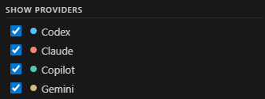
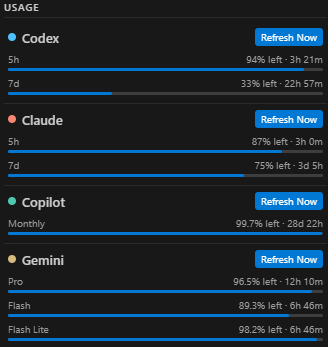
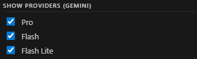
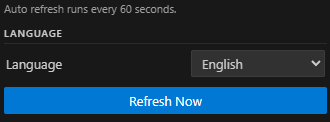
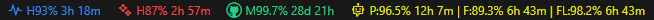
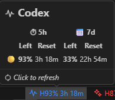

# AI Usage Status Bar

## Features

- Status bar usage summary for:
  - Codex
  - Claude
  - Copilot
  - Gemini
- Sidebar panel:
  - provider visibility toggle
  - Gemini model-group toggle (`Pro`, `Flash`, `Flash Lite`)
  - full refresh / per-provider refresh
- Fixed auto refresh: every 60 seconds
- Output channel: `AI Usage`

## Screenshots

### Panel - Show Providers

Controls which providers are shown in the status bar and panel.

### Panel - Usages

Shows per-provider usage cards and reset timing.

### Panel - Show Providers (Gemini)

Controls Gemini model-group visibility (`Pro`, `Flash`, `Flash Lite`).

### Panel - Languages

Sidebar language selector.

### Status Bar

Compact provider usage summary.

### Tooltip

Detailed usage information on hover.

## Settings

- `aiUsage.language`
- `codexUsage.enabled`
- `codexUsage.source` (`auto | command | sessionLog`)
- `codexUsage.command`
- `codexUsage.commandTimeoutMs`
- `codexUsage.sessionsRoot`
- `claudeUsage.enabled`
- `claudeUsage.sessionsRoot`
- `claudeUsage.command`
- `claudeUsage.commandTimeoutMs`
- `copilotUsage.enabled`
- `copilotUsage.command`
- `copilotUsage.commandTimeoutMs`
- `geminiUsage.enabled`
- `geminiUsage.showPro`
- `geminiUsage.showFlash`
- `geminiUsage.showFlashLite`

## License

[MIT](./LICENSE)
